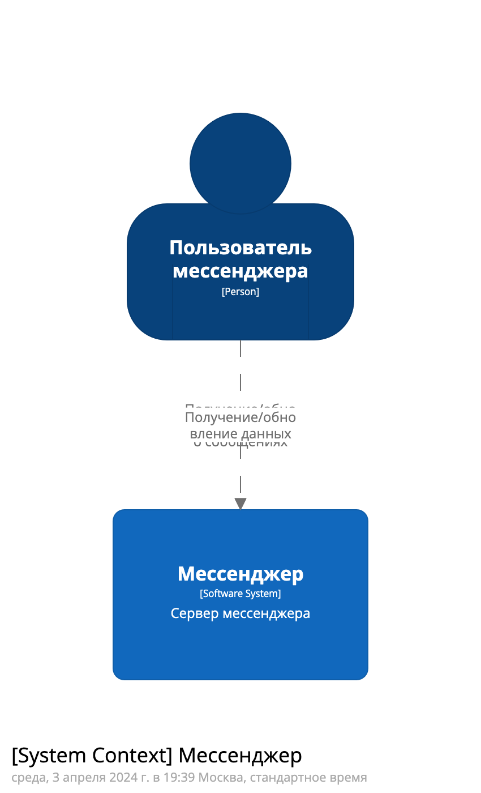
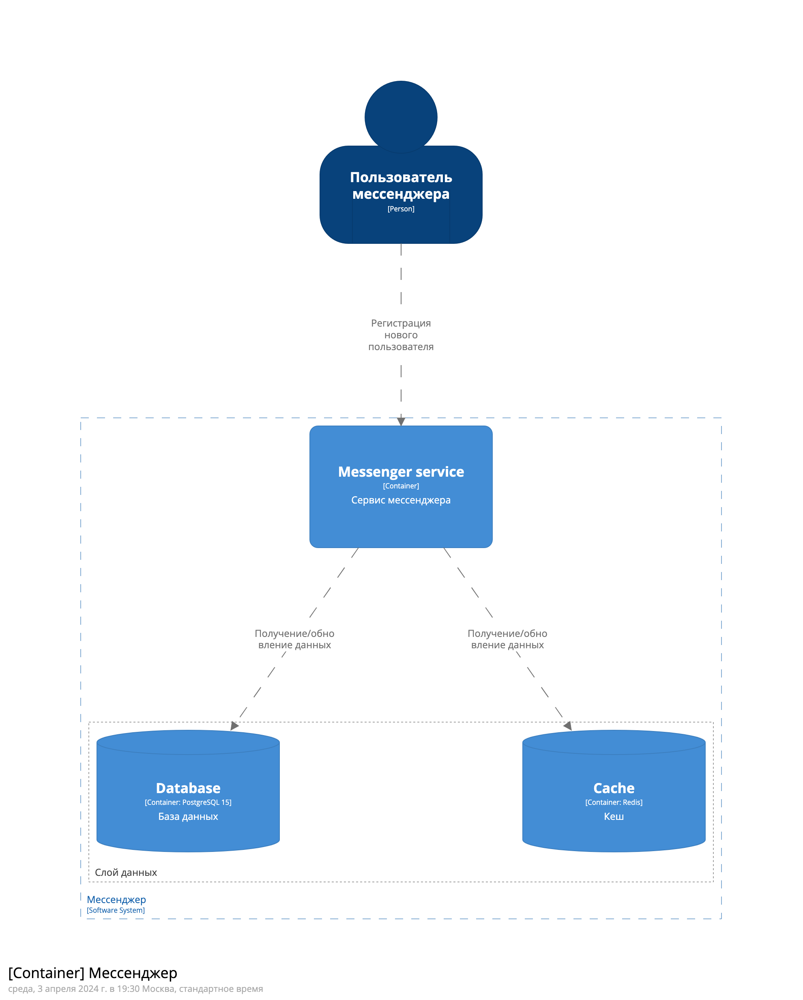
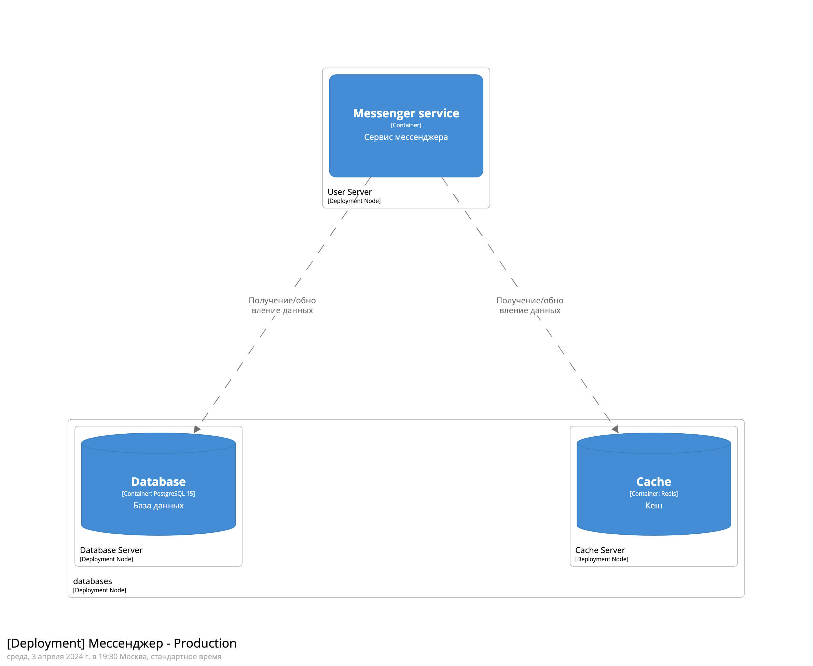
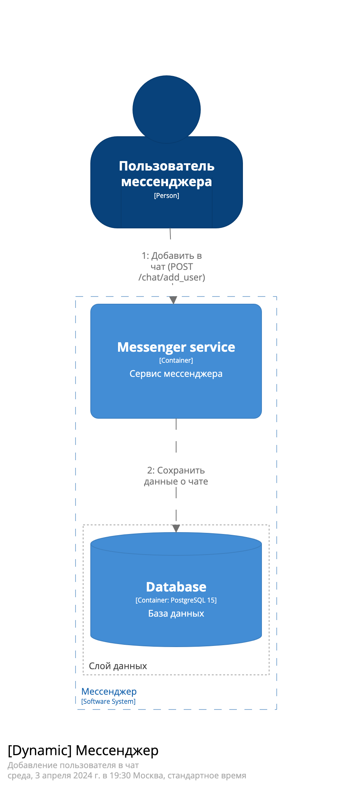

# Задание 01: Проектирование программной системы (Architecture As A Code)

## Вариант 5 Мессенджер

Приложение должно содержать следующие данные: 
- Пользователь
- Групповой чат 
- PtP Чат

Реализовать API:
- Создание нового пользователя
- Поиск пользователя по логину
- Поиск пользователя по маске имя и фамилии
- Создание группового чата
- Добавление пользователя в чат
- Добавление сообщения в групповой чат
- Загрузка сообщений группового чата
- Отправка PtP сообщения пользователю
- Получение PtP списка сообщения для пользователя

## Архитектура системы

### Контекстная диаграмма

### Диаграмма контейнеров

### Диаграмма развертывания

### Динамические диаграммы

